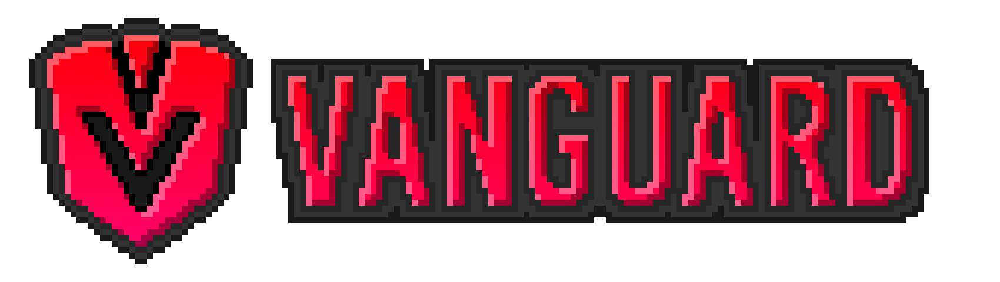
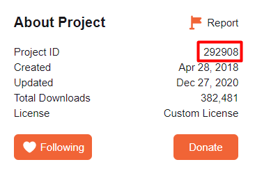

# 

**An easy-to-use auto-updater for Minecraft mods on the Fabric mod loader.**

## Why Vanguard?

Additionally to being easy-to-use, by using Vanguard and not a custom updater you will avoid chat message or toast notification spam. Vanguard uses a single main menu toast to indicate some mods are gonna be updated, and that's it. The user can also easily turn off Vanguard via its config, as well as check every mod that is using Vanguard (and the ones that are going to be updated next restart in yellow) in the config screen accessible via ModMenu on a client.

## Adding Vanguard to your buildscript:

```gradle
repositories {
	maven { url 'https://jitpack.io' }
	// Ladysnake bintray
	maven {
		name = "Ladysnake Libs"
		url = "https://dl.bintray.com/ladysnake/libs"
	}
}
```

```gradle
dependencies {
	// Includes Vanguard as a Jar-in-Jar dependency
	include "io.github.ladysnake:vanguard:${vanguard_version}"
}
```

You can find the current version of Vanguard in the [releases](https://github.com/Ladysnake/Vanguard/releases) tab of the repository on Github.

## Using Vanguard

Vanguard provides two ways to indicate where the updater should look at in order to determine the latest version and update the mod if necessary.

### CurseProxy Updater

If you host your mod on CurseForge, the first and simplest way to inform the updater about what it should do is the CurseProxy method. You just need to provide your project id and Vanguard will automatically check for new updates by using [CurseProxy](https://github.com/NikkyAI/CurseProxy/), so you don't need to bother about anything. You only need to include a custom value in your fabric.mod.json:

```json
"custom": {
	"vanguard": {
		"curse-project-id": "[YourCFProjectId]"
	}
},
```

You just need to replace `[YourCFProjectId]` with the value you can find on your CurseForge main project page.



### Custom Updater

If you do not host your mod on CurseForge or do not wish to rely on Vanguard to determine the latest version, the second method provided offers you a bit more freedom. You just need to indicate an update URL as follows:

```json
"custom": {
	"vanguard": {
		"update-url": "https://illuminations.glitch.me/latest?version="
	}
},
```

Naturally, you have to replace `https://illuminations.glitch.me/latest?version=`, but this example showcases that you need a URL that will determine the latest version for your mod from the Minecraft version that Vanguard will send. So for instance, for Minecraft 1.16.4, the updater will check `https://illuminations.glitch.me/latest?version=1.16.4`. Vanguard will make a GET request on the URL, and the format of the response must be JSON and respect the following format:

```json
{
    "version": "YourModVersionNumber",
    "filename": "YourMod.jar",
    "download": "YourModJarDownloadURL"
}
```

Please keep in mind Vanguard determines the latest version according to the [semantic versioning](https://semver.org/). You can also check `https://illuminations.glitch.me/latest?version=` with a correct Minecraft version to get some more concrete examples.
